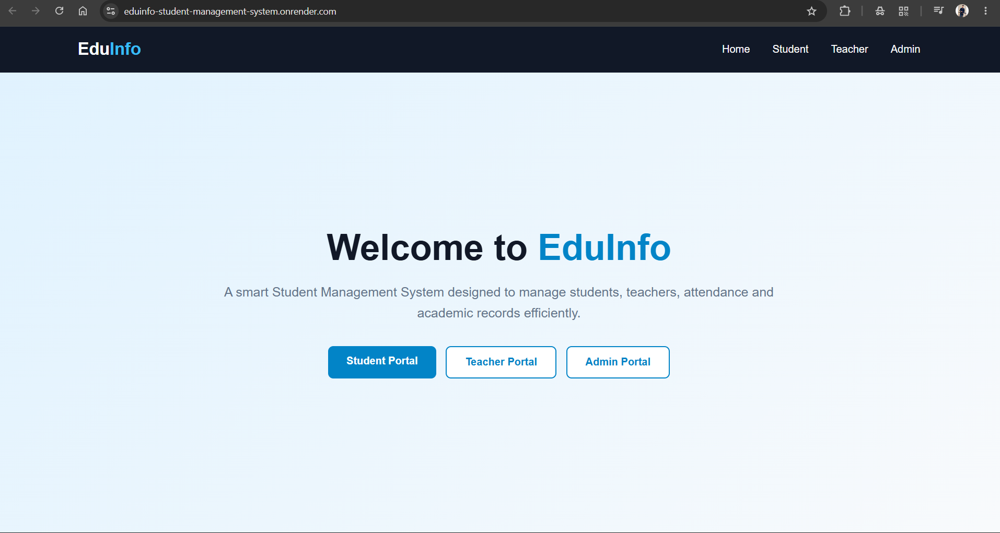
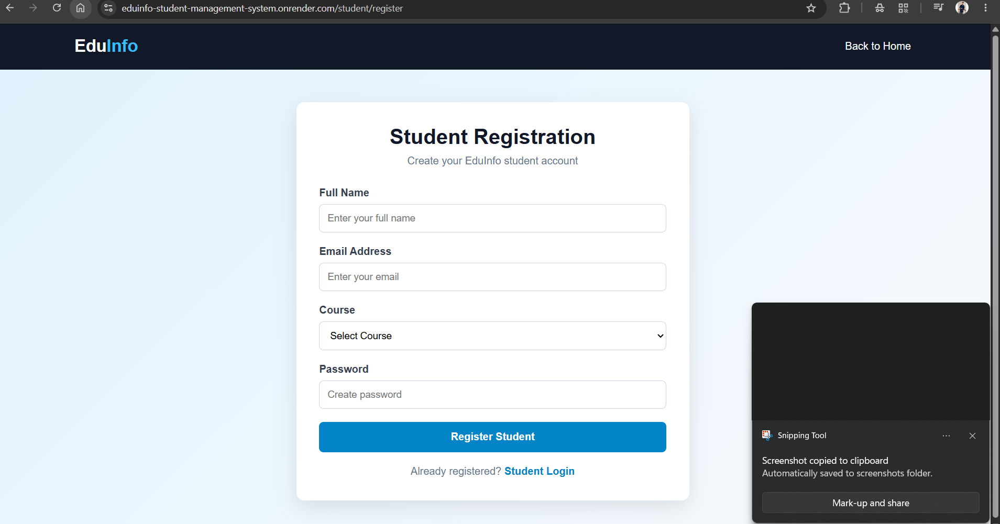
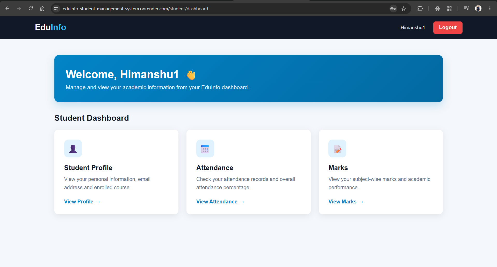
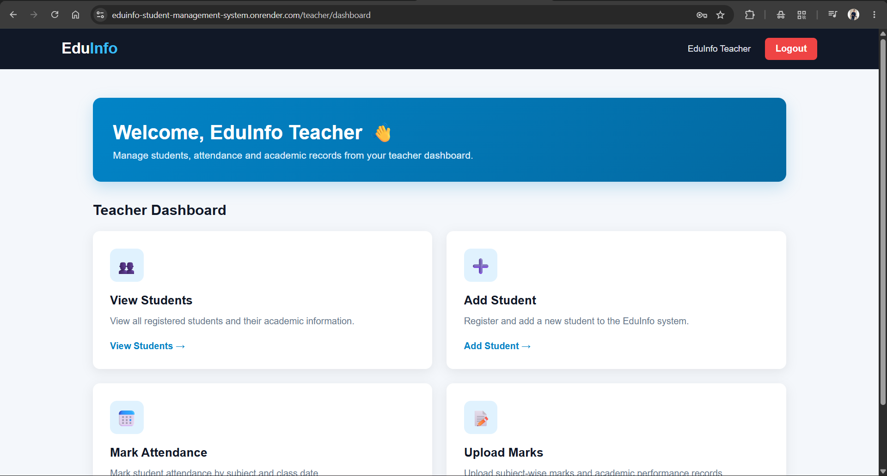
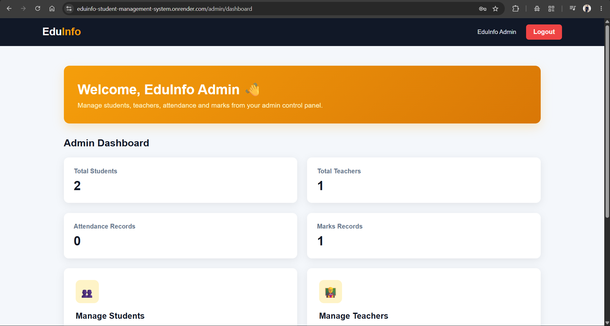
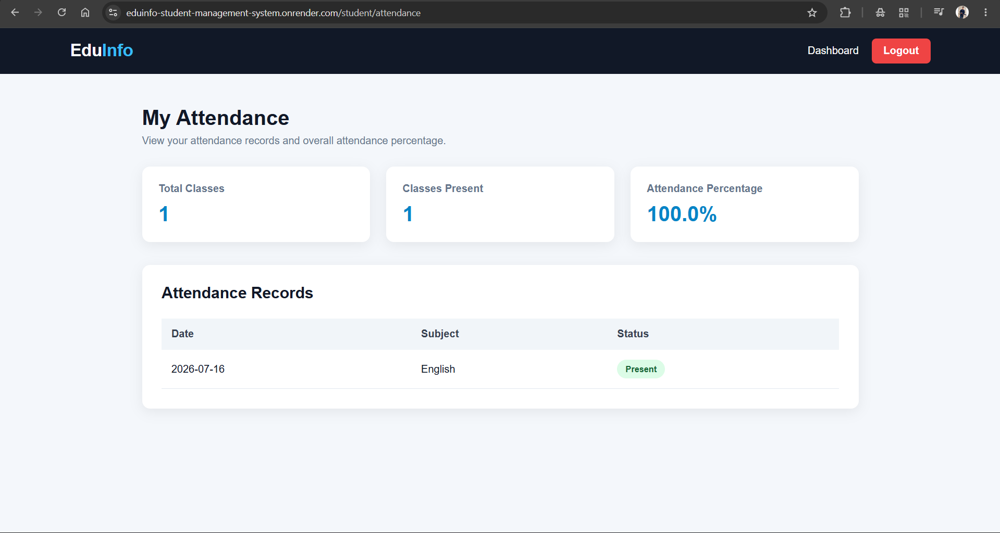
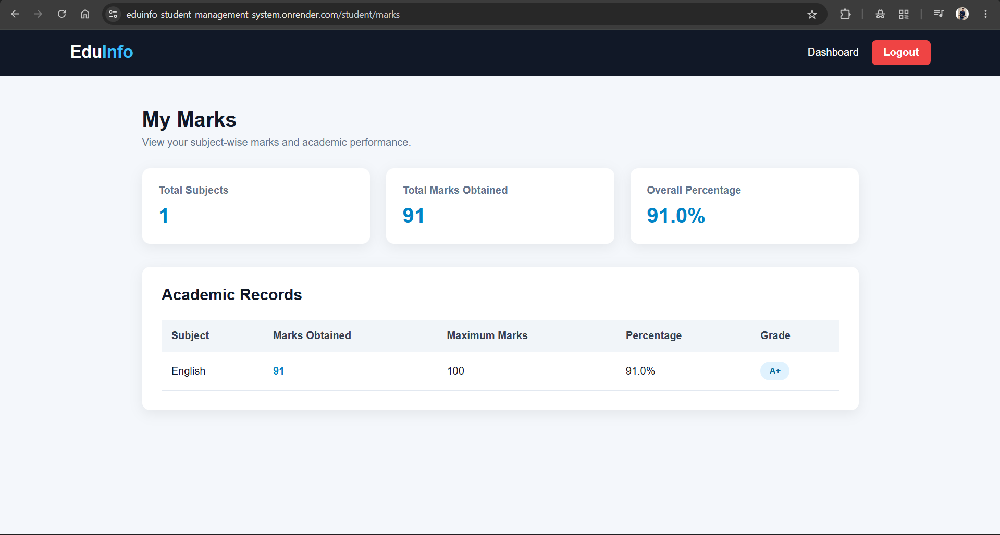

# 🎓 EduInfo - Student Management System

A modern **Student Management System** built using **Python, Flask, SQLite, HTML, CSS, and JavaScript**. The project provides separate portals for **Students, Teachers, and Administrators** to efficiently manage academic records, attendence, and marks.

---

## 🌐 Live Demo

🔗 **https://eduinfo-student-management-system.onrender.com**

---

# ✨ Features

### 👨‍🎓 Student Module
- Student Registration
- Secure Login
- Personal Dashboard
- View Attendence
- View Marks
- Profile Management

### 👨‍🏫 Teacher Module
- Teacher Login
- Dashboard
- View Students
- Add Students
- Mark Attendence
- Upload Student Marks

### 👨‍💼 Admin Module
- Admin Login
- Dashboard
- Manage Students
- Manage Teachers
- View Attendence Records
- View Marks Records

### 🔒 Security
- Password Hashing
- Session Management
- Secure Authentication

---

# 🛠️ Technologies Used

| Technology | Purpose |
|------------|---------|
| Python | Backend |
| Flask | Web Framework |
| SQLite | Database |
| HTML5 | Structure |
| CSS3 | Styling |
| JavaScript | Frontend Interaction |
| Git | Version Control |
| GitHub | Repository Hosting |
| Render | Deployment |

---

# 📸 Project Screenshots

<table>

<tr>
<td align="center"><b>🏠 Home Page</b></td>
<td align="center"><b>👨‍🎓 Student Login</b></td>
</tr>

<tr>
<td>

</td>

<td>

</td>
</tr>

<tr>
<td align="center"><b>👨‍🎓 Student Dashboard</b></td>
<td align="center"><b>👨‍🏫 Teacher Dashboard</b></td>
</tr>

<tr>
<td>

</td>

<td>

</td>
</tr>

<tr>
<td align="center"><b>👨‍💼 Admin Dashboard</b></td>
<td align="center"><b>✅ Attendence Management</b></td>
</tr>

<tr>
<td>

</td>

<td>

</td>
</tr>

<tr>
<td colspan="2" align="center"><b>📝 Marks Management</b></td>
</tr>

<tr>
<td colspan="2" align="center">

</td>
</tr>

</table>

---

# 📂 Project Structure

```
EduInfo-Student-Management-System
│
├── screenshots/
├── static/
├── templates/
├── tests/
├── app.py
├── requirements.txt
├── README.md
├── .gitignore
└── eduinfo.db
```

---

# 🚀 Installation

Clone the repository

```bash
git clone https://github.com/techy4745/EduInfo-Student-Management-System.git
```

Move into the project directory

```bash
cd EduInfo-Student-Management-System
```

Create a virtual environment

```bash
python -m venv venv
```

Activate the virtual environment

### Windows

```bash
venv\Scripts\activate
```

### Linux / macOS

```bash
source venv/bin/activate
```

Install dependencies

```bash
pip install -r requirements.txt
```

Run the application

```bash
python app.py
```

Open in your browser

```
http://127.0.0.1:5000
```

---

# 📌 Future Improvements

- Edit/Delete Students
- Search Students
- Export Attendence Reports
- Export Marks Reports
- Email Notifications
- PostgreSQL Database Support
- Role-Based Permissions
- Responsive Mobile UI

---

# 👨‍💻 Author

**Himanshu verma**

GitHub Profile

https://github.com/techy4745

---

# ⭐ Support

If you found this project helpful, consider giving it a ⭐ on GitHub.

---

## Thank You ❤️